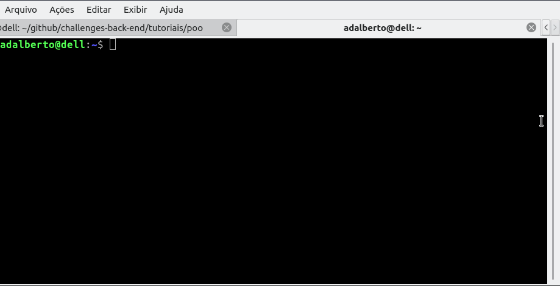
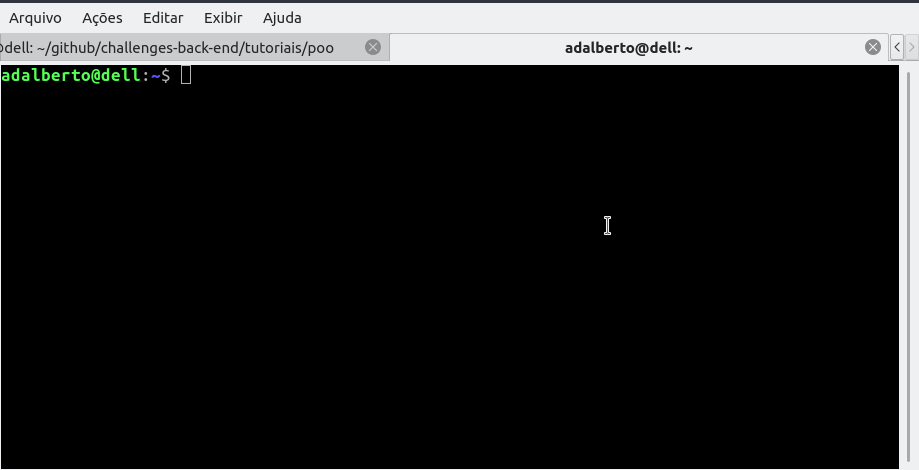

# Orientação a Objetos em Ruby 


### Classes e Variáveis de Instância em Ruby


Essa é uma foto que mostra a "blueprint" (planta) de uma lâmpada incandescente, muito usada no século passado e ainda usada em alguns círculos... Ela foi desenhada por uma equipe de profissionais, que antes de saírem por aí construindo coisas, gostam de definir como elas serão e ainda deixam esses lindos desenhos azuis com todos os detalhes de suas construções e aplicações.

E da mesma forma, devs juntos com grandes ou pequenas equipes formadas na diversidade profissional e criativa e nas abstrações da vida, forjam em seu  "core" (mente e coração) os mais diversos programas , aplicativos e páginas web para o deleite da massa que vibra e diz Gollllll!

Na linguagem Ruby, dentro do paradigma de Orientação a Obejtos, uma CLASSE pode ser considerada a nossa "blueprint" e é dentro dessa classe que estão localizadas as suas especificações (estados) e o seu comportamento (o que ela vai fazer e agir).

Na P.O.O estamos, sempre primeiro definindo, delimitando, criando regras, leis que resultem na criação da Classe e essa por sua vez irá possibilitar a criação dos objetos daquela classe.

Então é dentro de uma classe que escrevemos através de código tudo que aquele "ser vivo" irá poder fazer, mas isso não significa que esse pequeno ser criado não possa receber super poderes de outra classe, mas isso é assunto para um próximo tutorial.

Para defirmos uma classe em ruby, usamos a palavra reservada **class** e depois damos um nome em lembra maiúscula para ela e ao final da construção da classe colocamos um fim que no caso é a palavra **end** como no exemplo abaixo.

`````ruby
class Lampada 
end

`````

Nesse exemplo definimos que a nossa classe irá se chamar Lampada.

Agora temos que especificar como a nossa REPRESENTAÇÃO de uma lâmpada vai ser, Dentro de nossas limitações e conhecimento sobre o assunto ou então dentro das especificações que o nosso Amigo Querido Cliente nos der e se ele for o Thomas Edison , criador da lâmpada se prepare para mais de 1000 tentativas, mas no final o bulbo vai brilhar.

Para simplificar vamos exemplificar como poderia ser uma classe do tipo Lampada. Uma opção interessante e que ajuda muito no processo de criação e "descoberta" é utilizarmos de questionamentos, perguntas e pensar como a nossa lâmpada vai agir frente as nossas necessidades dentro de sua classe.

Veja abaixo na tabela como uma lâmpado pode **SER** e **AGIR**.

|                           Lampada                            |
| :----------------------------------------------------------: |
| Qual a cor da lâmpada? (azul, amarelo, rosa, verde) que tal usar o RGB como um sistema de cores ? |
|    Qual a voltagem da lâmpada? (5v,14v, 24v, 110v, 220v),    |
| Qual o tipo da lâmpada (led, filamento, mercúrio,, fluorescente) |
|              É uma lâmpada inteligente ou não ?              |
|             Qual a potência da lâmpada em Watts?             |
|            Qual a marca da lâmpada / fabricante?             |
|                Quantos lúmens a lâmpada tem?                 |
|                   Quanto custa a lâmpada?                    |
|               A lâmpada pode ligar e desligar                |
|                 A lâmpada pode mudar de cor                  |

Nessa tabela, podemos ver que fizemos algumas perguntas e também colocamos ações para a lâmpada com certeza do jeito que a tecnologia esta daqui a pouco, vamos até pedir pizza através de uma lâmpada ou mesmo acessar a internet, mas como essas ações seriam complicadas de desenvolver aqui, vamos ficar no básico, visto que nosso objetivo criativo é chegar numa planta esquemática de uma lâmpada, chamar ela a existência  e depois fazer ela funcionar.

A primeira coisa, depois de termos criado esse **ESQUEMA** é definir dentro de nosso programa quais serão  as nossas **VARIÁVEIS DE INSTÂNCIA**

Uma variável de instância é aquela variável que vai guardar as informações do que a nossa classe, enquanto definição de nossa "blueprint" ou melhor seus **atributos**, então no nosso exemplo a variável de instância pode ser a cor, o tipo de lâmpada, a marca da lâmpada e muito mais. Em ruby a variável de instância é sempre declarada com o símbolo do arroba @ e depois um nome que retrata a **QUALIDADE** daquela classe. Veja o exemplo abaixo.

`````ruby
class Lampada
    @cor
    @tipo
    @marca
end
    
`````

Se quisermos rodar essa aplicação no IRB e quisermos sair do muito das plantas e entrarmos no mundo dos objetos devemos fazer assim:


No exemplo vimos a definição de nossa class Lampada, com as variáveis de ambiente  @cor, @tipo, @marca e também vimos como devemos criar um **Objeto** a partir de nossa classe Lampada, usando o comando **new**.

Bom seguindo esse pensamento de já termos uma classe , bem como algumas atribuições feitas por nossas variáveis de instância, podemos pensar o seguinte:



Ops, vimos que apesar de já termos gerado as nossas variáveis de instância para a classe Lampada, nós não conseguimos acessar elas dando tanto um erro de sintaxe quanto também um erro de **Método => **  **NoMethodError (undefined method `cor' for #<<Lampada:0x000055feac3957f0>>**

Ou seja faltou uma interação, um corpo a corpo, uma "jogada" ou método para conseguirmos acessar essa informação de nossa classe na variável "objetoLampada" criada.

Mas é muito simples de resolver isso, basta criarmos o bendito método para conseguirmos fazer a "coisa linda" funcionar.

```ruby
class Lampada
    attr_accessor :cor, :tipo, :marca
    def initialize
        @cor = "azul
		@tipo = "led"
		@marca = "Osram"
	end
end
```

Antes de rodarmos a linda classe Lampada no nosso IRB, vamos entender mais alguns conceitos:

attr_accessor => ele é responsável por criar automáticamente no ruby os métodos getter e setter de outras linguagens diminuindo a quantidade de palavras que devemos declarar, mas o que significa isso ! Basicamente dentro da P.O.O , temos que declarar uma forma de acesso para pegarmos o dado disponibilizado e com esses métodos podemos fazer sem problemas isso.

Além do attr_accessor temos também o attr_reader e o attr_writer.

O attr_reader server para ler uma informação da classe e disponibilizar ela no mundo de nosso programa. E o attr_writer serve para colocarmos informações dentro de nossa variável de instância.

No caso optei por já colocar o attr_accessor pois ele nada mais é do que o attr_reader e attr_writer conjugados.

Lembrando que attr é a abreviatura para **atribute** ou seja os atributos de nossa classe.

Vamos rodar no IRB nosso programa.



Que bacana né, mas e agora ? Temos o attr_accessor, que tem a função de acessar a informação da variável de instância pra gente bem como ele também pode modificar essa informação pois poderiamos ter dado a instrução depois da criação do objeto para que o nosso objetoLampada tivesse a cor verde por exemplo em vez de azul e isso vale para todos os outros atributos a saber,  @cor, @tipo e @marca.

Uma coisa que temos que lembrar é que usei o def initialize para atribuir um valor inicial aos atributos da classe Lampada para mostrar o resultado na tela.

Um grande abraço e continuemos na capina do aprendizado.
